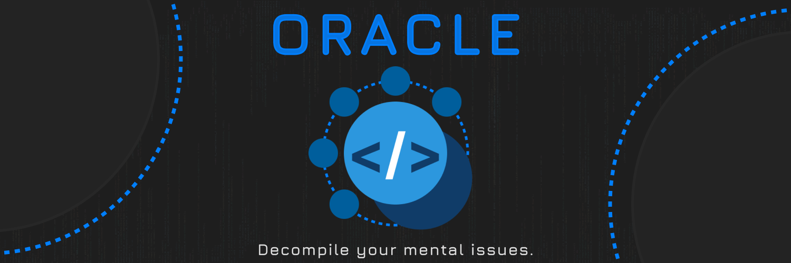

# BuiltinPlugins

Accurate decompilation of Roblox Studio's BuiltinPlugins. 

> [!WARNING]
> I am going to ULTRAKILL you.

### Credits

* [TheGreatSageEqualToHeaven](https://github.com/TheGreatSageEqualToHeaven) - Outputting decompiled source code from bytecode output ([`src/PatchRoot/`](src/PatchRoot))
* Of course, the [Oracle](https://discord.gg/prHW9TA4QW) decompiler for decompilation of Luauc bytecode 🙂

## 🚫 Problems

* Some files may have had unhandled control flow and improperly decompiled, which would result in incorrect table and `goto` output

## 🏛️ Licensing

Most of the BuiltinPlugins code is also proprietary and exclusively owned by Roblox Corporation ("Roblox"). Furthermore, any source code from this decompilation should be considered unlicensed code.

## Decompiler

These files were decompiled by the Oracle decompiler. 

Discord Invite: https://discord.gg/prHW9TA4QW

